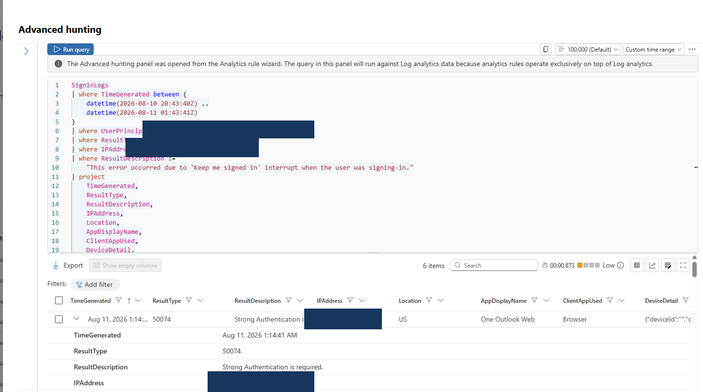
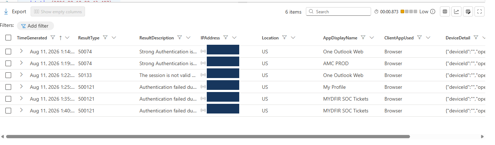
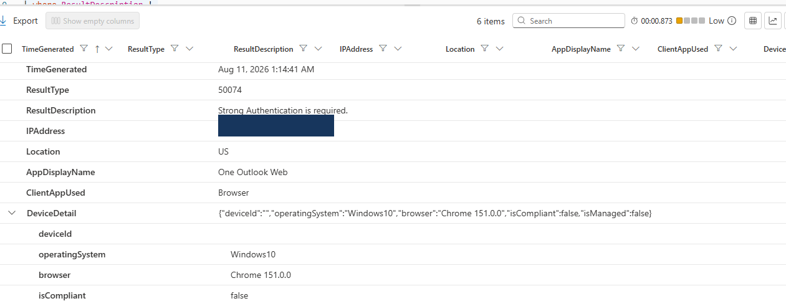
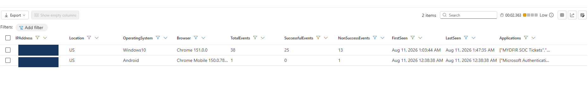

## Investigation Evidence

### 1. Focused KQL Investigation Query

This focused `SigninLogs` query reproduced the alert conditions and exposed the individual non-success authentication events included in the detection.

### 2. Authentication Results

Six qualifying non-success events were identified. The results included MFA requirements, an invalid session, and incomplete strong-authentication attempts.

### 3. Device Details

The device context showed consistent Windows and Chrome activity. The device ID was empty, and the endpoint was unmanaged and noncompliant.

### 4. Seven-Day Account Baseline

The seven-day baseline showed Windows/Chrome and Android authentication-broker activity originating from the same sanitized public IP address and US location.

## Full Investigation Report

For the complete methodology, timeline, Five-W analysis, verdict, recommendations, and reusable KQL queries:

[Download the complete sanitized investigation report](SOC_Identity_Authentication_Investigation_Portfolio_Rona_Playda.docx)

## Privacy Notice

Account names, public IP addresses, tenant identifiers, correlation IDs, and subscription details have been masked. This investigation was performed in an authorized SOC training environment.
